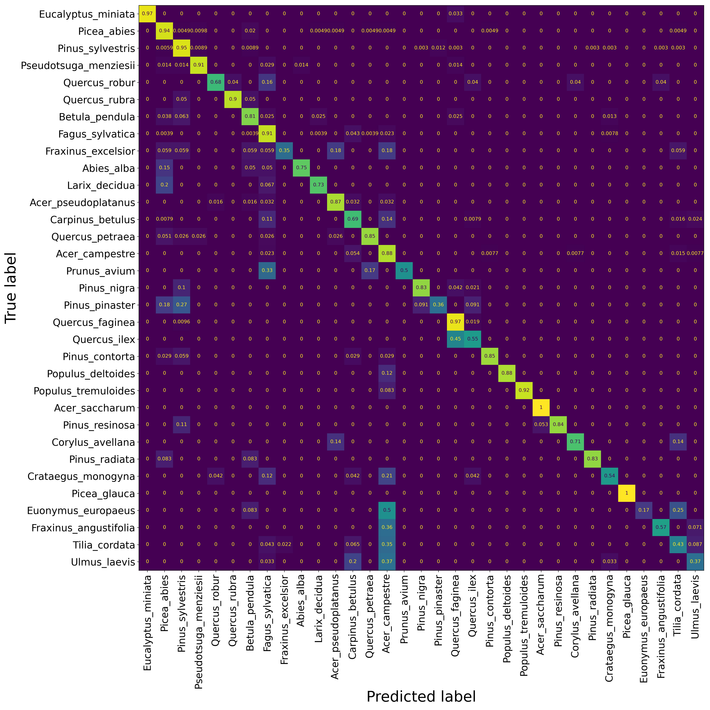

# Tree species identification using MinkNet

This repository contains the scripts for training and inference a deep-learning 
based tree species identification model utilizing terrestrial 3D point clouds (TLS, MLS, ULS) 
developed in the frame of the [3DForEcoTech data science competition](https://github.com/stefp/Tr3D_species).
The algorithm was developed using [Minkowski Engine](https://github.com/NVIDIA/MinkowskiEngine), 
an auto-differentiation library for sparse tensors. 

<p align="left"></p>


## Environment

To setup the working environment, please follow the instructions from 
[Minkowski Engine](https://github.com/NVIDIA/MinkowskiEngine) original source page. 
Additionally, [laspy](https://laspy.readthedocs.io/en/latest/index.html) library 
was installed to read LAS data format. 

## Neural network

The [MinkNet neural network](https://github.com/nrehush/minknet-tree-species/blob/main/minkowskifcnn.py) 
used here, performs 3D sparse convolutions on 
[voxelised point clouds](https://github.com/nrehush/minknet-tree-species/blob/main/tree_00069.png). It implies enriching 
the feature space using a multilayer perceptron in the 1st layer, 
and performing 3D convolutions in the next layers.

### Training

We calibrated the network using a 90/10 train/val split of the data provided 
within the [tree species benchmark](https://github.com/stefp/Tr3D_species). 
The best model was selected based on its performance (F1-score) on validation data. 
We trained the network with following hyperparameter set:

- Point number: 16384
- Voxel size: 0.1 m
- Number of iterations: 100K
- Batch size: 64
- Cosine learning rate scheduler (starting learning rate = 0.1)
- Optimizer: SGD with Nesterov momentum 
- Loss function: weighted cross-entropy
- Data augmentation: random rotation around Z axis

The network can be retrained by executing the following line from the working directory:
```
python train.py   --data_root data \
                  --n_points 16384 \
                  --voxel_size 0.1 \
                  --max_steps 100000 \
                  --batch_size 64 \ 
                  --lr 0.1 \
                  --out_dir model \
                  --weights treespecies.pth 
```

The --data_root directory should be structured as following: 
```
|-- data                    # root_dir
|   |-- train               # folder containing train/val data
|       |-- 00000.las       # the files should contain XYZ data of a single tree
|       |-- 00001.las 
|       |-- ...
|   |-- test                
|       |-- 10000.las 
|       |-- 10001.las 
|       |-- ...
|   |-- train.txt                               # list of train data
|   |-- val.txt                                 # list of val data
|   |-- tree_metadata_training_publish.csv        
```

We trained the network using a [NVIDIA TITAN V](https://www.nvidia.com/en-us/titan/titan-v/) 
GPU with 12 GB memory. The maximal GPU memory consumption during training was around 6 GB.  

### Deploying to new data 

Predictions on new data can be done as following: 
```
python predict.py   --data data/test \                        # path to your folder with LAS files
                    --out_file data/test_prediction.csv \     # path to the output file
                    --net_weights model/treespecies.pth \     # path to model weights
                    --n_iterations 50 \ 
                    --voxel_size 0.1 
```
The structure of the "data/test" directory is indicated on the schema above. PLEASE NOTE that the 
model weights are stored in a Zenodo repository (add link here) separately. 
To predict the test data from the [tree species benchmark](https://github.com/stefp/Tr3D_species), the network was applied to the same object for 50 times (--n_iterations). Each time 
the object was randomly rotated around its Z axis. The final class label was chosen 
using majority voting (as the most frequently predicted label).


